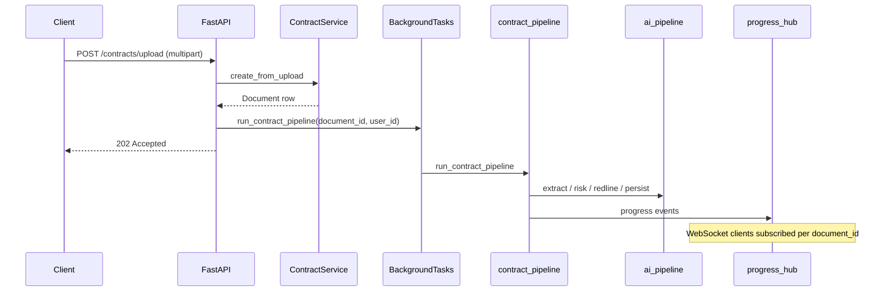

# Backend architecture

This document describes the **FastAPI service** under `backend/app/`: layering, async persistence, the AI orchestration stack, and operational hooks. For end-to-end system context (Next.js, Docker Compose, cost model), see the repository overview at [`docs/ARCHITECTURE.md`](../docs/ARCHITECTURE.md).

## Goals

- **Contract intelligence**: ingest PDF/DOCX/TXT, chunk legal text, extract structured clauses, score risk, propose redlines from an embedding-backed playbook, and record every significant action.
- **Enterprise controls**: JWT auth, role gates (`ADMIN`, `LEGAL_REVIEWER`, `GENERAL_COUNSEL`), audit logs, and rate limiting at the edge.
- **Testability**: services depend on repositories and explicit settings; integration tests run on **SQLite + aiosqlite** with pgvector types shimmed to JSON so CI does not require Postgres.

## Runtime stack

| Layer | Choice |
|-------|--------|
| API | FastAPI, Pydantic v2, `python-multipart` uploads |
| DB | SQLAlchemy 2.x async, `asyncpg` (Postgres), `aiosqlite` (tests) |
| Vectors | `pgvector` columns on `playbook_entries` and `clauses`; IVFFLAT indexes via Alembic `0002` |
| AI | LangChain (`langchain`, `langchain-openai`, `langchain-text-splitters`), optional LangSmith tracing |
| Resilience | `tenacity` retries with OpenAI-centric error taxonomy in `app/ai/openai_retry.py` |
| Ops | `structlog` request context, `slowapi` global throttling |

Configuration is **environment-driven** and matches root [`.env.example`](../.env.example); see `app/core/config.py` for field names and aliases (JWT, OpenAI, LangSmith, CORS, uploads, rate limits).

## Process and entrypoints

- **HTTP + WebSocket**: `uvicorn app.main:app`. The module-level `app` is produced by `create_app()`.
- **Factory** (`app/main.py`): registers CORS, `RequestContextMiddleware`, `SlowAPIMiddleware`, `AppError` and rate-limit handlers, mounts versioned API routes under `settings.api_v1_prefix` (default `/api/v1`), exposes health routes, and defines `lifespan` for logging, LangSmith env wiring, and upload directory creation.
- **WebSocket**: `GET /ws/contracts/{document_id}/progress?token=<JWT access token>`. The hub lives in `app/ws/hub.py` and is fed by the contract pipeline worker.

## Layered design

### API (`app/api/`)

- **`deps.py`**: `get_db` (session per request), `get_current_user` (Bearer JWT), `require_role(...)`, `get_request_id`, and helpers for optional WebSocket JWT parsing.
- **`api/v1/`**: Feature routers only—**auth**, **contracts**, **approvals**, **playbook**, **audit**—plus **`health`** mounted at the app root for probes.

Routers stay thin: validate inputs, call services, map domain errors via `AppError` subclasses.

### Services (`app/services/`)

Own **transaction boundaries**, orchestration, and authorization checks that need multiple repositories:

- **Auth**: registration, login, refresh rotation (`auth_service.py`).
- **Contract / clause**: upload lifecycle, visibility by owner (`contract_service.py`, `clause_service.py`).
- **Risk / redline**: assemble reads across clauses (`risk_service.py`, `redline_service.py`).
- **Approval**: GC queue and decisions with audit hooks (`approval_service.py`).
- **Playbook**: CRUD plus embedding refresh on write paths (`playbook_service.py`).
- **Audit**: append-only writes from `LLMUsageRecorder` and human actions (`audit_service.py`).
- **AI pipeline**: high-level document processing entry used by workers (`ai_pipeline.py`).

### Repositories (`app/repositories/`)

`BaseRepository` provides generic `get_by_id`, `list_all`, `add/save/delete`. Feature repos add filtered queries (e.g. clauses by document, audit filters). They **do not** commit; services do.

### Models (`app/models/`)

SQLAlchemy 2 declarative mappings with `Mapped[...]`, UUID primary keys, and `JSON` columns where SQLite parity matters (`risk_assessments`, `audit_logs`). Relationship types use `TYPE_CHECKING` imports to satisfy Ruff/pyflakes without import cycles.

Enums in `app/models/enums.py` mirror string columns for portability.

## Persistence and migrations

- **Session** (`app/db/session.py`): builds async engine from `Settings.database_url`; uses `NullPool` for SQLite tests. `rebind_engine_and_session()` supports test env overrides.
- **Alembic** (`alembic/`): async `env.py`; `0001_initial` ensures `CREATE EXTENSION vector` (Postgres) then `metadata.create_all` equivalent tables; `0002_vector_indexes` creates IVFFLAT indexes **only on Postgres** paths.

## Security model

- **JWT**: access + refresh tokens; validation in `app/core/security.py`. Subjects map to `users.id`.
- **Passwords**: Argon2 via `pwdlib` (see service layer).
- **Roles**: `UserRole` gates playbook admin routes and GC approval routes via `require_role`.
- **Rate limits**: SlowAPI defaults from settings; auth routes also declare per-endpoint limits.

## AI and document processing

### Ingestion (`app/ai/ingestion/`)

- **`loaders.py`**: PDF (`pypdf`), DOCX (`python-docx`), plain text; optional OCR hook via existing interface when text is empty.
- **`chunker.py`**: recursive split tuned for legal prose (size/overlap per spec).
- **`pipeline.py`**: load → OCR-if-needed → chunk → embed → persist clause rows / embeddings as designed.

### Chains (`app/ai/chains/`)

- **Extraction**: structured outputs for clause types with confidence (`extraction.py` / `extraction_chain.py`).
- **Risk**: deterministic `rule_engine` first; optional LLM fallback integrated with `LLMUsageRecorder` and retries (`risk.py`).
- **Redline**: RAG over `playbook_entries` via pgvector similarity → `RedlineSuggestion` shape (`redline_chain.py`).
- **Agent**: ordered orchestration extract → assess → redline → approval trigger on HIGH+ (`agent.py`).

### Infrastructure helpers

- **`embeddings.py`**: OpenAI embeddings with sha256-keyed memory cache + optional DB cache table.
- **`vector_store.py`**: async SQLAlchemy retriever; short-circuits when not on Postgres/pgvector.
- **`langsmith_setup.py`**: reads LangSmith/LangChain env flags; chains use `.with_config(run_name=..., tags=..., metadata={user_id, document_id, ...})` for trace correlation.
- **`llm_usage.py`**: `LLMUsageRecorder` persists token/use metadata into `audit_logs` and structured logs.

### Prompts (`app/ai/prompts/`)

Versioned Markdown prompt files (per clause type plus risk reasoning). Runtime loading via `prompt_catalog.py` (import path avoids clashing with the prompts **package** directory).

## Background work

`app/workers/contract_pipeline.py` is scheduled from the upload route as a **FastAPI `BackgroundTasks`** job. It runs the AI pipeline, updates document status/progress, broadcasts WebSocket events, and triggers approvals when policy requires.

## Error handling and HTTP mapping

`app/core/exceptions.py` defines `AppError` subclasses with explicit `http_status`:

- `404` `NotFoundError`, `401` `UnauthorizedError`, `403` `ForbiddenError`, `409` `ConflictError`
- `422` `ValidationAppError`, `400` `BadRequestError`
- `502` `ExternalServiceError`, `503` `ServiceUnavailableError`

`main.py` maps `AppError` to JSON `{"detail", "request_id"}`. SlowAPI emits `429` with the same envelope shape.

## Observability

- **Structured logging**: `configure_logging` in lifespan; request ID middleware propagates correlation headers.
- **LangSmith**: optional; never required for tests (keys absent → no outbound traces).

## Testing

- **`tests/conftest.py`**: sets `TEST_DATABASE_URL`, forces SQLite URL, monkeypatches `pgvector.sqlalchemy.Vector` to JSON for DDL, resets schema per test, exposes `httpx.AsyncClient` against the ASGI app.
- **Suites**: auth, upload (mocked pipeline), extraction chain (RunnableLambda mock), risk engine (deterministic rules), redline RAG (mock retriever), smoke import test.

Pytest asyncio scope is pinned in `pytest.ini` for stable event loops.

## Data model overview (logical)

The ORM maps the following primary tables (see Alembic `0001_initial` for canonical DDL):

| Table | Purpose |
|-------|---------|
| `users` | Identity; `role` stores `UserRole` string |
| `documents` | Upload metadata, extracted text, pipeline `status`, `progress_percent` |
| `clauses` | Extracted units with `clause_type`, `confidence_score`, optional `embedding` vector |
| `risk_assessments` | Per-clause risk level, explanation, `rule_hits`, optional LLM `token_usage` JSON |
| `redlines` | Proposed edits; links optional `playbook_entry_id` |
| `playbook_entries` | Policy rows with `clause_type`, guidelines, optional `embedding` |
| `approvals` | Escalations tying `document_id` / optional `clause_id` to reviewers |
| `audit_logs` | Append-only actions including LLM usage records |
| `embedding_cache` | Optional deduplication for embedding vectors keyed by content hash |

Cross-database note: **`JSON`** is used instead of Postgres-only `JSONB` on selected columns so SQLite integration tests can `create_all` without dialect-specific types.

## Upload and pipeline sequence



## Configuration surface (subset)

These environment variables are consumed in `Settings` and are the ones most developers touch first (full list in [`.env.example`](../.env.example)):

| Variable | Role |
|----------|------|
| `DATABASE_URL` | Async SQLAlchemy DSN (`postgresql+asyncpg://...` or test SQLite) |
| `JWT_SECRET_KEY` / `JWT_ALGORITHM` | HS256 signing |
| `ACCESS_TOKEN_EXPIRE_MINUTES`, `REFRESH_TOKEN_EXPIRE_DAYS` | Token TTLs |
| `OPENAI_API_KEY`, `OPENAI_MODEL`, `OPENAI_EMBEDDING_MODEL` | Model calls and embeddings |
| `VECTOR_DIM` | Must match pgvector column width and embedding model |
| `LANGSMITH_*`, `LANGCHAIN_TRACING_V2` | Optional tracing |
| `CORS_ORIGINS` | Browser origins list |
| `MAX_UPLOAD_MB` | Upload size guard |
| `RATE_LIMIT_PER_MINUTE`, `RATE_LIMIT_BURST` | SlowAPI tuning |

## Request lifecycle

1. **Correlation**: `RequestContextMiddleware` stamps/propagates `request_id` (header or generated) into structlog context.
2. **Auth**: Protected routes resolve the current user once per request via `get_current_user`.
3. **DB session**: `get_db` yields an `AsyncSession`; routers/services **commit** at explicit success points (e.g. after mutations).
4. **Errors**: Services raise `AppError` subclasses; the centralized handler never leaks stack traces in JSON responses.

## WebSocket hub semantics

- Clients connect with **document-scoped** URLs so compromise of one subscription does not enumerate the fleet.
- The access token is passed as a **query parameter** because browser WebSocket APIs cannot attach arbitrary headers during the opening handshake in all environments.
- The server discards inbound frames after subscription setup; the primary flow is **server → client** notifications.

## Package map (quick navigation)

```
backend/app/
├── main.py                 # FastAPI factory + WS route
├── api/
│   ├── deps.py
│   └── v1/                 # auth, contracts, approvals, playbook, audit, health
├── core/                   # config, exceptions, logging, rate_limit, security
├── db/                     # base + session
├── models/                 # SQLAlchemy ORM + enums
├── repositories/           # data access primitives
├── schemas/                # Pydantic DTOs
├── services/               # domain orchestration
├── workers/                # background pipeline entry
├── ws/                     # progress broadcaster
└── ai/
    ├── chains/             # agent, extraction, risk, redline
    ├── ingestion/          # loaders, chunker, pipeline
    ├── prompts/            # versioned Markdown prompts
    ├── embeddings.py
    ├── vector_store.py
    ├── llm_usage.py
    ├── langsmith_setup.py
    └── openai_retry.py
```

## Operational checklist (staging / production)

1. **Postgres**: enable `vector` extension before running migrations (handled in `0001_initial` for vanilla Postgres).
2. **Secrets**: `JWT_SECRET_KEY` must be high entropy; rotate on compromise.
3. **OpenAI**: `readyz` reports whether a key is configured—CI/test profiles may use dummy keys when readiness is not polled.
4. **IVFFLAT**: Created in `0002_vector_indexes`; expect indexing/build guidance for large corpora in that migration file.
5. **Backups**: RPO/RTO owned by operators; ORM does not encrypt at rest.

## Agent orchestration contract

The **agent** (`app/ai/chains/agent.py`) owns semantic ordering:

1. **Extract** structured clauses (with confidence) from chunked text.
2. **Assess** risk per clause using the rule engine first; call the LLM only when policy allows and record usage.
3. **Redline** using playbook retrieval + generative merge as implemented.
4. **Escalate** approvals when severity crosses the configured threshold (HIGH+ in product language).

Each LangChain Runnable is expected to run with **LangSmith metadata** (`user_id`, `document_id`, chain name) when tracing is enabled, so support can correlate UI incidents with traces.

## Performance and compliance notes

- **Embeddings** are batched where possible and cached by sha256 of normalized text to avoid duplicate OpenAI calls during dev/test reruns.
- **Retrieval** uses pgvector cosine distance under Postgres; SQLite tests **skip** realistic ANN behavior.
- **Upload I/O** writes under `settings.uploads_dir`; production should eventually back this with object storage while preserving the service boundary.
- **Audit logs** capture human-driven mutations and automated LLM usage summaries suitable for export to a SIEM (see audit repository filters).
- **Approvals** retain `requested_by_id`, `reviewer_id`, timestamps, and notes suitable for dual-control review narratives.

## Related documentation

| Topic | Location |
|-------|-----------|
| System-wide architecture | [`docs/ARCHITECTURE.md`](../docs/ARCHITECTURE.md) |
| **Authoritative HTTP route reference** | [`backend/API.md`](./API.md) (repo `docs/API.md` should link here) |
| Environment variables | [`.env.example`](../.env.example) |

## Design constraints honored in this codebase

- **No inline imports** in hot paths; skills/rules prefer top-level imports.
- **LLM usage** is recorded for extraction, risk LLM fallback, and redline paths.
- **Retries** use explicit exception classification compatible with OpenAI + `httpx` transport failures.
- **Strict typing** in services and API layers; repositories remain generic over ORM classes.

## Future-friendly extension points

- Swap **OCR** implementation behind `ocr_interface.py` without changing routers.
- Add **synchronous** workers (Celery/RQ) by moving `run_contract_pipeline` entrypoint; keep service methods unchanged.
- **Multi-tenant** isolation would start at `User` / `Document` ownership checks and extend metadata passed to LangSmith + audit logs.

---

*This file is maintained alongside the backend package. When the public API surface changes, update `backend/API.md` in the same commit.*
