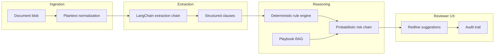

# AI pipeline — chains, retrieval, observability

This document ties runtime behavior to concrete modules under `backend/app/ai/`.

## High-level flow

1. **Ingest** binary → text (`document_text.py`, optional OCR hook `ocr_interface.py`).
2. **Extract** clauses with schema-bound LLM outputs (`ai/chains/extraction.py`, prompts in `ai/prompts.py`).
3. **Score** deterministic violations (`ai/chains/rule_engine.py`) + narrative severity (`ai/chains/risk.py`).
4. **Retrieve** similar playbook rows using **hybrid search** when `HYBRID_PLAYBOOK_RETRIEVAL=true` on Postgres: pgvector cosine top‑`PLAYBOOK_VECTOR_POOL` + `tsvector` FTS top‑`PLAYBOOK_LEX_POOL`, fused with **RRF**, then **lexical overlap rerank** (not a cross-encoder). SQLite tests stay vector-only. Falls back to dense-only on SQL errors.
5. **Materialize** `Redline` rows referencing `playbook_entry_id` for UI deep links. (`risk.py` may skip the LLM via `risk_judgment_cache` unless `RISK_USE_REACT=true`.)

## Chains — responsibilities

| Module                     | Function                                                              | Output                                         |
| -------------------------- | --------------------------------------------------------------------- | ---------------------------------------------- |
| `ai/chains/extraction.py`  | Maps raw text windows to typed clause DTOs aligned with `Clause` ORM  | JSON → Pydantic models for API validation      |
| `ai/chains/rule_engine.py` | Deterministic checks (regex / ontology hits) before LLM embellishment | Rule findings with citations into clause spans |
| `ai/chains/risk.py`        | Summaries + qualitative severity informed by playbook excerpts        | `RiskLevel` aligned enums (`models/enums.py`)  |

Keep **pure logic** in the rule engine so regressions are unit-testable without model calls.

## Retriever strategy

1. Embed clause headline + span using `Settings.openai_embedding_model`.
2. `SELECT ... ORDER BY embedding <=> :q LIMIT k` against `playbook_entries`.
3. Diversity re-rank: penalize duplicate `clause_type` unless similarity extremely high.
4. Attach top passages into `risk.py` `PLAYBOOK_HINT` channel (see string composition inside chain).

Tuning notes live in `docs/SCALING.md`.

## Prompt strategy

- Centralize copy in `ai/prompts.py`; avoid string concatenation sprawl inside chains.
- Use **dual-system prompts**: system = role + constraints, user = excerpt + JSON contract.
- Encourage **explicit nulls** rather than guessed numbers for financial caps.

## Structured outputs

Leverage LangChain `.with_structured_output` where available; for older paths, use grammar-enforced JSON + `pydantic` validation with a single retry on `ValidationError`.

## LangSmith setup (operator walkthrough)

1. Create a LangSmith account and organization for your company — use SSO if available.
2. Issue an API key; drop it into `.env` as `LANGSMITH_API_KEY`.
3. Set `LANGCHAIN_TRACING_V2=true` **and** mirror `LANGSMITH_TRACING=true` (see `.env.example` comments).
4. Choose a dedicated `LANGSMITH_PROJECT=legal-agent-prod` vs `...-dev` to avoid noisy prod data.
5. In the LangSmith UI, open **Projects → legal-agent-dev** after running a local extraction; you should see nested traces: `extraction` → `ChatOpenAI` → tool/format steps.
6. Attach **baseline datasets** — upload CSV of `(contract_id, clause_type, gold JSON)` for regression diffs.
7. Turn on **alerting** (Slack webhook) for run failures if you promote automatic evals.

> Screenshot checkpoints (describe during onboarding): Project switcher → runtable with latency column → span detail showing prompt + completion tokens.

## Model configuration

`Settings` (`core/config.py`) owns:

- `openai_model` — default `gpt-4o-mini` for extraction; escalate to `gpt-4o` for final risk summarization when needed.
- `openai_embedding_model` — must match `VECTOR_DIM` / `EMBEDDING_DIMENSIONS` constant.

## Failure escalation path

1. Log structured event via `structlog` (`core/logging_setup.py`).
2. If LLM invalid JSON → single repair prompt with schema excerpt.
3. If still failing → mark clause as `needs_human_review` and skip auto redlines.

## Testing hooks

- Golden-file tests comparing rule-engine outputs (no network).
- Recording replay via LangChain `MockChat` for CI when secrets absent.
- For full integration, mirror `.github/workflows/ci.yml` service block locally.

