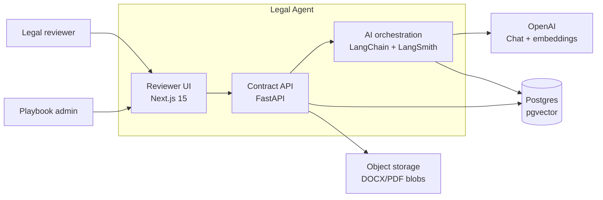
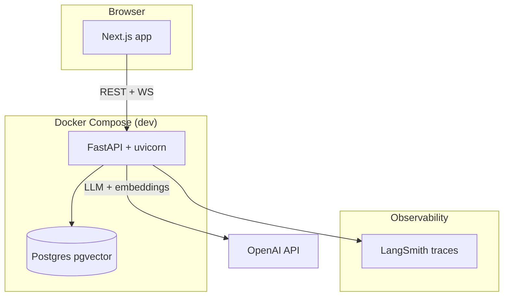
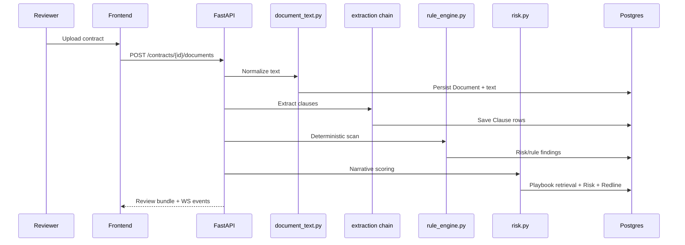
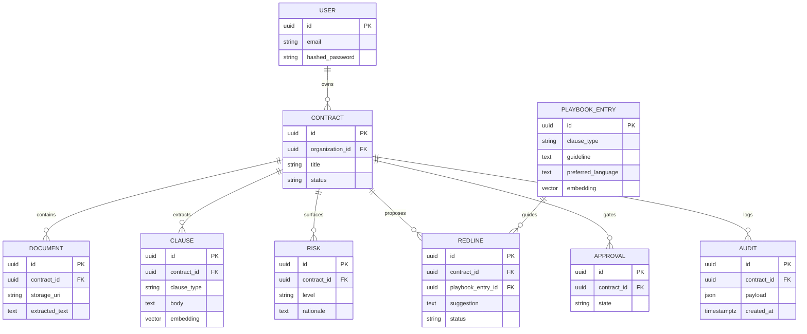
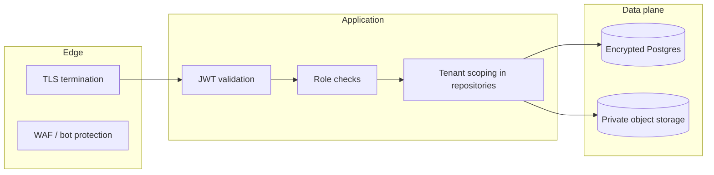
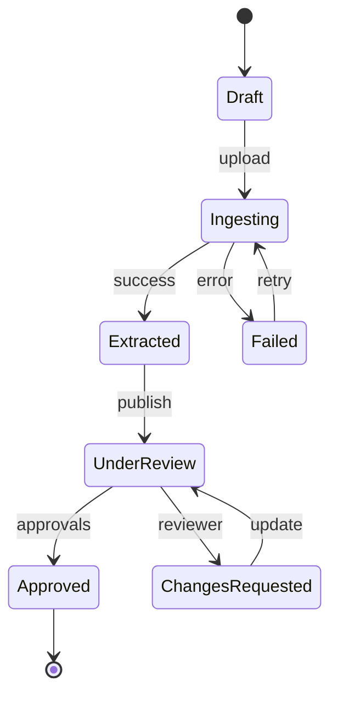

# System architecture

Legal Agent is a **multi-tier contract intelligence platform**: Next.js reviewers interact with a FastAPI backend that orchestrates document ingestion, retrieval-augmented reasoning (`RAG`), and immutable audit trails on Postgres with `pgvector`.

## System context

## Container view

Production replaces Compose with managed services (see `docs/DEPLOYMENT.md`) but preserves logical boundaries.

## Request lifecycle (happy path)

WebSocket fan-out (`ws/hub.py`) pushes incremental status for long-running ingestion jobs.

## Backend layering

| Layer | Path | Notes |
| --- | --- | --- |
| Core config | `app/core/config.py` | `Settings` env binding |
| Security | `app/core/security.py`, `rate_limit.py`, `middleware.py` | JWT + SlowAPI |
| Persistence | `app/db/session.py`, `app/db/base.py` | Async SQLAlchemy engine |
| Models | `app/models/*.py` | Declarative metadata + pgvector columns |
| Repositories | `app/repositories/*.py` | Tenant-aware queries |
| AI | `app/ai/chains/*`, `prompts.py` | LangChain compositions |
| Realtime | `app/ws/hub.py` | Contract-scoped channels |

Routers will sit alongside `app/main.py` (added by API executor) providing `/api/v1/*`.

## AI pipeline layering

Detailed narrative + tuning lives in `docs/AI_PIPELINE.md`. Code anchors:

- `ai/chains/extraction.py` — translates text windows to structured clauses.
- `ai/chains/rule_engine.py` — encodes non-negotiable legal policy checks without LLM cost.
- `ai/chains/risk.py` — combines signals + RAG hints, producing reviewer-ready rationales.

`ai/prompts.py` centralizes templates referenced by `docs/PROMPTS.md`.

## Data model (ERD)

Actual column sets live in respective modules (`models/user.py`, `models/contract.py`, …); this diagram is **relational intent** for engineers onboarding.

## Security model

See `docs/SECURITY.md` for encryption, secret management, and OWASP mapping.

## Multi-tenancy considerations

- **Data**: every contract row carries `organization_id` (explicit FK forthcoming in migrations). Repositories must reject cross-tenant IDs early.
- **Vectors**: composite indexes on `(organization_id, clause_type)` prevent cross-customer retrieval leakage when multiple tenants share a cluster.
- **Prompt templates**: optionally fork `playbook_entries` per tenant; never reuse embeddings across tenants without legal review.

Phase 2 options (RLS vs schema split) are detailed in `docs/SCALING.md`.

## Async & reliability

- FastAPI leverages asyncio end-to-end; blocking PDF libs should run in threadpool wrappers when necessary.
- `slowapi` adds guardrails for expensive endpoints (upload + `/analyze`).
- Future workers (`docker-compose.yml` stub) drain heavy OCR / batch embedding queues.

## Observability spine

- `structlog` JSON logs for ingestion + AI steps (`core/logging_setup.py`).
- LangSmith traces connect prompts ↔ completions with minimal PII (`Settings.langchain_project`).
- OpenTelemetry export remains a TODO tracked in deployment docs.

## Configuration surfacing

`.env.example` enumerates runtime switches. Backend fields map via Pydantic aliases — see comments there for JWT naming subtleties (`ACCESS_TOKEN_EXPIRE_MINUTES` vs `JWT_ACCESS_TOKEN_EXPIRE_MINUTES`).

## Developer ergonomics

| Command | Purpose |
| --- | --- |
| `make up` | Full Compose stack |
| `./scripts/dev_bootstrap.sh` | DB + migrations + seed |
| `make backend.run` | Local uvicorn |
| `make check` | Lint + tests |

## Known gaps (tracked externally)

- `app/main.py` not yet present — containers expect `uvicorn app.main:app`.
- Alembic directory pending — `make backend.migrate` guarded until `alembic.ini` exists.
- HTTP routers will materialize alongside service layer consuming repositories.

## Related reading

- `docs/AI_PIPELINE.md` — chain internals.
- `docs/API.md` — endpoint intention vs OpenAPI.
- `docs/DEPLOYMENT.md` — path to production.
- `docs/EVOLUTION.md` — product phases influencing architecture.

---

## Deep dive: contract ingestion pipeline

The ingestion subsystem must balance **fidelity** (lawyers notice mangled numbering) with **cost** (tokens). Key implementation touchpoints:

1. **Upload validation** — `MAX_UPLOAD_MB` from settings; MIME allowlist at router layer (future) should align with security guidance.
2. **Text normalization** — `document_text.py` should strip repeating headers, convert smart quotes, and unify whitespace while preserving clause numbering markers.
3. **Segmentation heuristic** — optional paragraph classifier determines whether to send chunks serially or in parallel to `extraction.py`.
4. **Persistence** — documents store both storage URI (blob) and normalized text to avoid re-parsing on every analysis run.

Failure handling:

- OCR degradation triggers reviewer alert + `Audit` entry with severity `WARNING`.
- Partial extraction must mark affected clauses with `needs_review` without blocking entire contract publish.

---

## Deep dive: playbook vector lifecycle

Embeddings are not magical — they require hygiene:

1. **Content selection** — concatenate `title + guideline + preferred_language` with weights; avoid redundant boilerplate that drowns semantic signal.
2. **Normalization** — lowercase legal citations? Usually **no** — citations are case-sensitive; instead normalize whitespace only.
3. **Dimensionality** — `EMBEDDING_DIMENSIONS` constant must match SQL `Vector(dim)` definitions.
4. **Reindex discipline** — any edit to playbook text invalidates vectors; track `content_sha256` column (future) to skip redundant OpenAI calls.

---

## Deep dive: reviewer UX contract

Front-end engineers should assume:

- Redlines carry optional `playbook_entry_id` for deep links (see `schemas/redline.py`).
- Risk cards map to enumerations for color semantics consistent with design tokens.
- WebSocket payloads mirror REST resource shape to avoid dual DTO maintenance.

---

## Extensibility hooks

| Hook | Purpose |
| --- | --- |
| `ApprovalRepository` | Plug sequential or parallel approval graphs |
| `AuditRepository` | Stream to SIEM |
| `PlaybookRepository.list_all_entries` | Bulk export for customer audits |

---

## Performance budgets

Initial targets (tune with real traces):

- p95 upload + text extraction `< 5s` for 20MB DOCX on typical laptop-class CPU.
- p95 clause extraction `< 45s` for 40-page MSA using `gpt-4o-mini`.
- p99 API availability `>= 99.9%` once production SLO program begins.

Document deviations in postmortems with trace links.

---

## Failure mode compendium (architecture-level)

1. **DB pool exhaustion** — raise `sqlalchemy_pool_size` cautiously; prefer horizontal scaling.
2. **LLM timeouts** — user-visible message should suggest retry; background job should persist stage.
3. **Vector index corruption** — rebuild from playbook source; maintain CSV backups.

---

## Glossary

| Term | Meaning |
| --- | --- |
| Playbook | Curated standards mapped to vectors |
| Redline | Suggested contract edit w/ rationale |
| Clause | Atomic legal section extracted for analysis |
| Review bundle | API payload joining clauses, risks, redlines |

---

## Architectural principles

1. **Human finality** — automation proposes; humans dispose except where policies are categorical (`rule_engine.py`).
2. **Auditability** — if an action cannot be explained from `Audit` rows + LangSmith trace ID, it is not production-ready.
3. **Tenant safety** — missing tenant filter is a **severity-1 defect**, not a nit.
4. **Cost transparency** — ship metrics for tokens per contract alongside accuracy KPIs.

These principles guide trade discussions when attractive shortcuts appear.

---

## Model–service matrix (future)

| Bounded context | Service candidate | Current module |
| --- | --- | --- |
| Identity | Auth service | `user.py`, `security.py` |
| Ingestion | Media worker | `document_text.py` |
| Inference | GPU-adjacent worker | `ai/chains/*` |
| Policy | OPA sidecar | `rule_engine.py` precursor |

Monolith remains valid until traffic or compliance forces the split — see `EVOLUTION.md`.

---

## Diagram: state machine (contract review)

Concrete statuses will align with enums once migrations land.

---

## Testing architecture

- **Unit**: repositories with SQLite? Prefer async PG test container (CI pattern in `.github/workflows/ci.yml`).
- **Contract**: OpenAPI schemathesis (future).
- **AI eval**: see `docs/DEBUGGING_AI.md`.

---

## Contribution interface

Infrastructure PRs should update **this document** when:

- New external integration introduced.
- Data model relationships change.
- Security boundaries move (e.g., introducing a worker VPC).

---

## Closing

Architecture is the shared map — keep it honest. When reality diverges from this document, fix the doc in the same PR as the code unless under strict embargo (then file a follow-up ticket within 24h).
