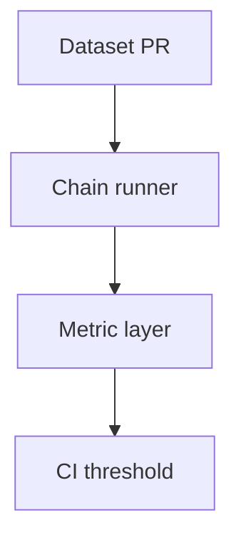

# Debugging AI decisioning

AI regressions are **product bugs** — treat them with the same rigor as payment or auth incidents.

## What to log (minimum viable observability)

| Field | Why |
| --- | --- |
| `trace_id` / LangSmith run ID | Correlate API request ↔ chain execution |
| `contract_id`, `clause_id` | Domain anchors |
| `model`, `prompt_hash`, `temperature` | Reproduce LLM behavior |
| `tokens_in`, `tokens_out`, `latency_ms` | Cost + performance |
| `retrieved_playbook_ids` | RAG transparency |
| `rule_hits` vs `llm_flags` | Shows whether failure is deterministic or generative |

Wire these through `structlog` processors in `backend/app/core/logging_setup.py` and ensure PII is redacted (see `docs/SECURITY.md`).

## Tracing decisions end-to-end

1. **Start in LangSmith** — filter on `status:error` or high latency.
2. **Open the root span** — confirm extraction produced valid JSON; expand child spans for retriever timings.
3. **Diff prompts** — compare against last known good deploy using stored prompt hash.
4. **Validate playbook corpus** — stale embeddings yield confident-but-wrong suggestions.
5. **Replay offline** — export JSONL from LangSmith and feed through a local notebook / pytest harness.

## Common failure modes

| Symptom | Likely cause | Mitigation |
| --- | --- | --- |
| Empty clauses | OCR or paragraph segmentation | Inspect `document_text.py`, rerun with alternate parser |
| Wrong dollar cap | Model swapped k / M suffixes | Add numeric normalization post-processor |
| Overconfident green light | Missing rule-engine case | Extend `rule_engine.py`, add regression unit test |
|(playbook Hallucinated fallback)| Temperature too high + weak grounding | Lower temperature; require citation span |
| Slow requests | Large context + no batching | Chunk orchestration; cache embeddings (`docs/COST_OPTIMIZATION.md`) |

## Prompt regression strategy

1. Snapshot **10–30 canonical contracts** with lawyer-approved labels under `fixtures/contracts/`.
2. For each change to `ai/prompts.py`, run `pytest -m golden` (future marker) comparing JSON outputs with tolerances.
3. Maintain **semantic diff** — for prose fields, use LLM-as-judge only in nightly jobs, not per PR, to control cost.

## Eval harness sketch



Implementation outline:

```text
tests/
  eval/
    cases/
      msa_fin_cap.json
    runner.py   # loads dataset, calls extraction + risk sequentially
    metrics.py  # precision/recall on clause labels + JSON schema validity
```

- `runner.py` should accept `--record` to push traces into LangSmith for human QA.
- Fail CI if schema validity < 100% or rule-engine recall drops >2% vs baseline.

## Interactive debugging tips

- Temporarily enable `LOG_LEVEL=debug` but **never** print raw prompts with PII in shared Slack.
- Use `--reload` backend inside Compose while iterating; pair with `make logs`.
- When stuck, bisect **data vs model vs prompt** by holding two factors constant.

## Closing the loop

Every production failure should produce:

1. A LangSmith annotation (👍/👎 + comment).
2. A ticket referencing clause IDs.
3. Either a new rule-engine test OR a prompt dataset row — otherwise the bug will recur.
