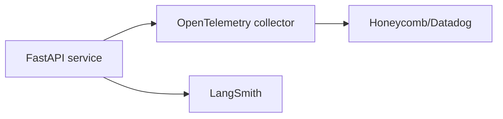

# Production deployment guide

This document complements `docker-compose.yml` (developer bootstrap) with **hardened production** recommendations.

## Managed Postgres + pgvector

Preferred providers:

| Provider | Notes |
| --- | --- |
| Supabase | pgvector enabled; great for MVPs; verify enterprise VPC options |
| Neon | Serverless autoscaling; enable IP allowlists |
| AWS RDS Aurora PG | pgvector extension; pair with Parameter Groups tuning |
| Crunchy Bridge | Opinionated Postgres ops |

Baseline checklist:

- [ ] Enable HA (multi-AZ) for prod.
- [ ] PITR backups + quarterly restore drills.
- [ ] Rotate credentials via secret manager (not console copy/paste).
- [ ] Configure `max_connections` vs app pool size (`sqlalchemy_pool_size`).

## Container platforms

| Platform | Fit |
| --- | --- |
| Fly.io | Simple global edge + volumes for temp uploads |
| Render | Straightforward managed TLS |
| AWS ECS Fargate | Enterprise IAM + VPC integration |
| GCP Cloud Run | Scale-to-zero friendly for async workers |

## Autoscaling signals

- CPU > 60% sustained + request queue depth.
- `429` surge from OpenAI → backoff + horizontal pod scaler cooldown.

## Observability stack



- Export traces + metrics via OTel SDK (future instrumentation PR).
- Dashboard: p95 review latency, embedding job backlog, DB wait events.
- LangSmith remains the **AI-specific** pane; do not duplicate prompts into metrics systems.

## File storage

- Local `/tmp` path (`Settings.uploads_dir`) is dev-only.
- Production should use **S3 / GCS** with SSE-KMS + lifecycle policy (delete after N days).

## CI/CD outline

GitHub Actions (see `.github/workflows/ci.yml`) already validates lint, tests, and Docker builds. Extend with:

```yaml
# .github/workflows/release.yml (stub — customize per org)
name: release
on:
  push:
    tags: ["v*"]
jobs:
  deploy:
    runs-on: ubuntu-latest
    steps:
      - uses: actions/checkout@v4
      - name: Configure cloud CLI
        run: echo "install aws/flyctl via OIDC"
      - name: Build & push image
        run: echo "docker buildx + ECR"
      - name: Migrate database
        run: echo "fly ssh console -C 'alembic upgrade head'"
      - name: Traffic shift
        run: echo "blue/green or canary"
```

Use **tag-promotion** (staging → production) instead of branch-based deploys for compliance.

## Environment promotion

| Stage | Purpose |
| --- | --- |
| `dev` | noisy logs, fake keys |
| `staging` | scrubbed contracts, prod-like data volume |
| `prod` | locked config, enforced MFA |

## Runbook essentials

1. **Migrate first**, then deploy app code expecting new columns.
2. Keep **playbook re-embedding** manual gated until queue infrastructure exists (`docs/SCALING.md`).
3. Document rollback = `alembic downgrade -1` + previous image — practice quarterly.

## Compliance add-ons

- Customer-specific **BAA / DPA** storage per tenant row.
- Optional **VPC peering** for customers who refuse public internet egress — pair with NAT gateways for OpenAI access.
