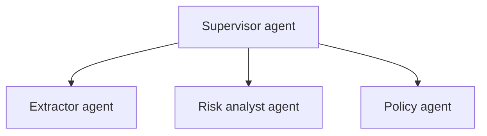

# Product evolution — MVP to autonomous contracting

Legal Agent's MVP focuses on **informed human review** — everything thereafter deepens automation while keeping counsel in control.

## MVP scope (current trajectory)

- Contract upload + OCR/text cleanup.
- Clause extraction + deterministic rules + LLM risk narration.
- Playbook-grounded redlines tied to `PlaybookEntry` rows.
- Human approvals + immutable `Audit` records.

## Phase 2 — collaborative negotiation hub

- Multi-party commenting with optimistic UI (WebSocket hub in `ws/hub.py`).
- Version diffing between vendor iterations with clause alignment.
- **Architecture add:** event bus (Redis Streams or NATS) fanning out review activity.

## Phase 3 — assisted redlining in-editor

- Export tracked changes (DOCX `python-docx` enhancements).
- Suggested comment bubbles mapped to `Redline` rationale strings.
- **Architecture add:** document transform service isolated from API for CPU-heavy jobs.

## Phase 4 — integrations

| System | Value |
| --- | --- |
| DocuSign | Close the loop once lawyer accepts risk posture |
| Slack | Notify #legal when approvals queue spikes |
| Salesforce | Tie contracts to Opportunity stage + ARR |

Implementation: OAuth apps + signed webhook receivers + idempotency keys.

## Phase 5 — multi-agent supervisor

- Supervisor decides which sub-agent runs based on contract metadata (jurisdiction, spend tier).
- Introduces **policy engine** (OPA / custom DSL) reading centralized JSON rules — complements `rule_engine.py`.

## Phase 6 — domain fine-tunes / SLMs

- Collect customer-approved labels for low-risk clause types.
- Train adapter (LoRA) or deploy smaller SLM for extraction while retaining GPT-4o as judge.

## Phase 7 — eval + marketplace

- Hosted regression hub where law firms ship **playbook packs** (curated vectors + rationale).
- Revenue share + vetting pipeline.

## Architectural shifts summary

1. **Monolith Friendly API** → **Service boundaries** (ingest, infer, integrate).
2. **Synchronous LLM** → **Queued jobs** with idempotent stages.
3. **Single-region** → **Data residency** switches per tenant.

Track decision ADRs in `docs/adr/` (future folder) as these phases progress.
